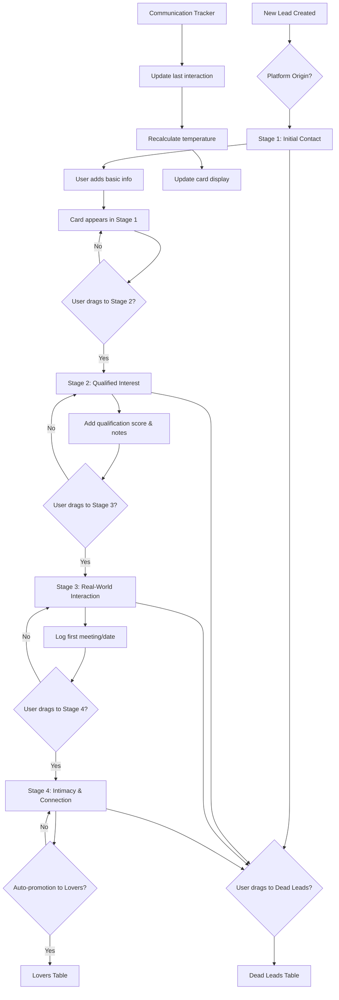

# UI Specifications and User Workflows

## Application Layout Overview

### Main Dashboard Layout
```
┌─────────────────────────────────────────────────────────────────┐
│                          Header Bar                             │
│  [Game Logo] [Dashboard] [Analytics] [Settings] [User Menu]     │
├─────────────────────────────────────────────────────────────────┤
│                                                                 │
│                      Funnel Board View                         │
│                                                                 │
│ ┌───────────┬───────────┬───────────┬───────────┬─────────────┐ │
│ │  Stage 1  │  Stage 2  │  Stage 3  │  Stage 4  │  Analytics  │ │
│ │ Initial   │Qualified  │Real-World │Intimacy & │   Panel     │ │
│ │ Contact   │Interest   │Interaction│Connection │             │ │
│ │           │           │           │           │             │ │
│ │ [Card]    │ [Card]    │ [Card]    │ [Card]    │ [Pie Chart] │ │
│ │ [Card]    │ [Card]    │ [Card]    │           │             │ │
│ │ [Card]    │           │           │           │ [Stats]     │ │
│ │           │           │           │           │             │ │
│ └───────────┴───────────┴───────────┴───────────┴─────────────┘ │
│                                                                 │
│ ┌─────────────────────────┬─────────────────────────────────────┐ │
│ │      Lovers Table       │        Dead Leads Table           │ │
│ │ [Card] [Card] [Card]    │ [Card] [Card] [Card] [Card]        │ │
│ └─────────────────────────┴─────────────────────────────────────┘ │
└─────────────────────────────────────────────────────────────────┘
```

## Funnel Workflow Diagram



## Lead Card Component Design

### Card Layout (Photo-based)
```
┌─────────────────────────────────┐
│  ┌─────────┐  Sarah J.    🔥     │  <- Name + Temperature Icon
│  │ Photo   │  Tinder      8/10   │  <- Platform + Score
│  │ 120x120 │                    │
│  │         │  📅 2 days ago     │  <- Days since last spoken
│  └─────────┘  🇺🇸 United States  │  <- Country flag + name
│                                 │
│  Outgoing, coffee lover...      │  <- Personality preview
│  ───────────────────────────────  │
│  [💬 Add Note] [📞 Log Call]    │  <- Quick action buttons
└─────────────────────────────────┘
```

### Temperature Visual Indicators
- **🔥 Hot**: Red flame icon, red border
- **🌡️ Warm**: Orange thermometer icon, orange border  
- **❄️ Cold**: Blue snowflake icon, blue border

### Qualification Score Display
- 1-3: ⭐ (Single star, red)
- 4-6: ⭐⭐ (Double star, orange)
- 7-8: ⭐⭐⭐ (Triple star, yellow)
- 9-10: 🌟 (Glowing star, gold)

## Lead Detail Modal

```
┌─────────────────────────────────────────────────────────────────┐
│  Sarah Johnson Details                              [X] Close   │
├─────────────────────────────────────────────────────────────────┤
│                                                                 │
│  ┌─────────────┐                                                │
│  │             │  Name: Sarah Johnson                           │
│  │ Profile     │  Platform: Tinder                              │
│  │ Photo       │  Country: 🇺🇸 United States                    │
│  │ 200x200     │  Score: ⭐⭐⭐ 8/10                              │
│  │             │  Temperature: 🔥 Hot                           │
│  └─────────────┘  Origin: Coffee shop downtown                 │
│                                                                 │
│  Personality Traits:                                            │
│  ┌─────────────────────────────────────────────────────────────┐ │
│  │ Outgoing personality, loves hiking and outdoor activities, │ │
│  │ coffee enthusiast, works in marketing, dog lover          │ │
│  └─────────────────────────────────────────────────────────────┘ │
│                                                                 │
│  Notes:                                                         │
│  ┌─────────────────────────────────────────────────────────────┐ │
│  │ Met through mutual friend recommendation. Really enjoys     │ │
│  │ deep conversations about travel and life goals. Planning   │ │
│  │ coffee date for next weekend.                              │ │
│  └─────────────────────────────────────────────────────────────┘ │
│                                                                 │
│  Recent Interactions:                                           │
│  ┌─────────────────────────────────────────────────────────────┐ │
│  │ 📱 Jan 15, 2:30 PM - Outgoing Message                      │ │
│  │    "Asked about weekend plans"                             │ │
│  │ 📱 Jan 14, 8:45 PM - Incoming Message                      │ │
│  │    "Thanks for the restaurant recommendation!"             │ │
│  │ ☕ Jan 12, 7:00 PM - Date                                   │ │
│  │    "First coffee date - went really well"                  │ │
│  └─────────────────────────────────────────────────────────────┘ │
│                                                                 │
│  [📝 Edit Lead] [📞 Log Interaction] [🗑️ Move to Dead Leads]    │
└─────────────────────────────────────────────────────────────────┘
```

## Analytics Panel Design

### Lead Origin Pie Chart
```
┌─────────────────────────────────┐
│       Lead Sources              │
│                                 │
│     ┌─────────────────┐         │
│     │    🥧 Pie       │         │  
│     │   Chart         │         │
│     │                 │         │
│     └─────────────────┘         │
│                                 │
│ 📱 Tinder: 35% (14 leads)       │
│ 💕 Bumble: 25% (10 leads)       │
│ 📸 Instagram: 20% (8 leads)     │
│ 👥 Offline: 15% (6 leads)       │
│ 💬 WhatsApp: 5% (2 leads)       │
│                                 │
│ Total Active Leads: 40          │
└─────────────────────────────────┘
```

### Funnel Statistics
```
┌─────────────────────────────────┐
│     Funnel Performance          │
│                                 │
│ Stage 1: 15 leads (37.5%)       │
│ ████████████▓▓▓▓ 75%            │
│                                 │
│ Stage 2: 12 leads (30.0%)       │
│ ████████████▓▓▓▓ 60%            │
│                                 │
│ Stage 3: 8 leads (20.0%)        │
│ ████████▓▓▓▓▓▓▓▓ 40%            │
│                                 │
│ Stage 4: 5 leads (12.5%)        │
│ █████▓▓▓▓▓▓▓▓▓▓▓ 25%            │
│                                 │
│ Conversion Rate: 12.5%          │
│ Lovers: 3 | Dead: 12           │
└─────────────────────────────────┘
```

## Responsive Design Breakpoints

### Mobile Layout (< 768px)
- Single column funnel (stacked vertically)
- Compact card design
- Swipe gestures for stage changes
- Collapsible analytics panel

### Tablet Layout (768px - 1024px)
- Two-column funnel layout
- Medium-sized cards
- Side panel for analytics

### Desktop Layout (> 1024px)
- Full four-column funnel
- Large cards with full details
- Fixed analytics panel

## Drag and Drop Interactions

### Visual Feedback States
1. **Dragging**: Card becomes semi-transparent, shows shadow
2. **Valid Drop Zone**: Stage highlights with green border
3. **Invalid Drop Zone**: Red border with prohibition icon
4. **Drop Success**: Brief green flash animation

### Drop Rules
- Can move between any adjacent stages
- Can move directly to Dead Leads from any stage
- Cannot move backwards (except to Dead Leads)
- Stage 4 leads auto-promote to Lovers after 7 days

## Color Scheme and Design System

### Primary Colors
- **Primary Blue**: #2563EB (buttons, links)
- **Success Green**: #10B981 (hot temperature, success states)
- **Warning Orange**: #F59E0B (warm temperature, alerts)  
- **Cool Blue**: #06B6D4 (cold temperature, info)
- **Danger Red**: #EF4444 (delete, errors)

### Stage Colors
- **Stage 1**: Light blue (#DBEAFE)
- **Stage 2**: Light green (#D1FAE5)
- **Stage 3**: Light orange (#FED7AA)
- **Stage 4**: Light purple (#E9D5FF)
- **Lovers**: Gold (#FEF3C7)
- **Dead Leads**: Light gray (#F3F4F6)

### Typography
- **Headers**: Inter, 24px, Bold
- **Card Names**: Inter, 16px, Semibold
- **Card Details**: Inter, 14px, Regular
- **Body Text**: Inter, 16px, Regular

## Accessibility Features

### Keyboard Navigation
- Tab through all interactive elements
- Enter/Space to activate buttons
- Arrow keys for funnel navigation
- Escape to close modals

### Screen Reader Support
- ARIA labels for all interactive elements
- Semantic HTML structure
- Alternative text for images
- Status announcements for drag/drop

### Visual Accessibility
- High contrast mode support
- Focus indicators
- Minimum 4.5:1 color contrast
- Scalable text (up to 200%)

## User Experience Flows

### Adding a New Lead
1. Click "Add New Lead" button
2. Upload photo (optional)
3. Fill required fields (name, platform)
4. Set qualification score
5. Lead appears in Stage 1
6. Success notification

### Moving Lead Through Funnel
1. Drag lead card from current stage
2. Visual feedback during drag
3. Drop in target stage
4. Automatic timestamp update
5. Stage transition animation
6. Update interaction log

### Logging Communication
1. Click lead card quick action
2. Select interaction type
3. Add notes and timestamp  
4. Update lead temperature
5. Refresh card display

## Performance Considerations

### Image Optimization
- Lazy loading for profile photos
- WebP format with JPEG fallback
- Responsive image sizes
- Progressive loading

### Data Loading
- Paginated lead lists
- Virtual scrolling for large datasets
- Optimistic UI updates
- Background data syncing

### Animation Performance
- Hardware-accelerated CSS transforms
- Debounced drag operations
- Efficient re-rendering with React.memo
- Smooth 60fps animations